# <div align="center">🏠 RoomiePay 🏠</div>

<div align="center">
  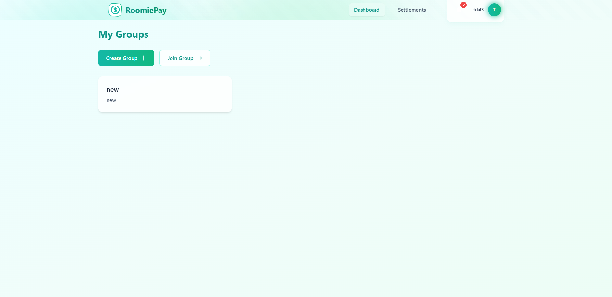
  
  ### *Split expenses, not friendships!*
  
  <p>
    <a href="#-features">Features</a> •
    <a href="#-screenshots">Screenshots</a> •
    <a href="#%EF%B8%8F-technologies-used">Technologies</a> •
    <a href="#-installation">Installation</a> •
    <a href="#-project-structure">Project Structure</a> •
    <a href="#-database-schema">Database Schema</a> •
    <a href="#-api-endpoints">API Endpoints</a> •
    <a href="#-contributors">Contributors</a> •
    <a href="#-license">License</a>
  </p>
</div>

---

## 🌟 Overview

**RoomiePay** is a modern expense management and settlement application designed specifically for roommates, friends, and groups who share expenses. Stop worrying about who owes whom and how much - let RoomiePay handle the math!

> "Living together is already complicated enough. Splitting the bills shouldn't be." 
> 
> — RoomiePay Team

---

## ✨ Features

<table>
<tr>
  <td width="50%">
    <h3>💰 Easy Expense Tracking</h3>
    <ul>
      <li>Add expenses quickly</li>
      <li>Categorize and describe each expense</li>
      <li>View transaction history</li>
    </ul>
  </td>
  <td width="50%">
    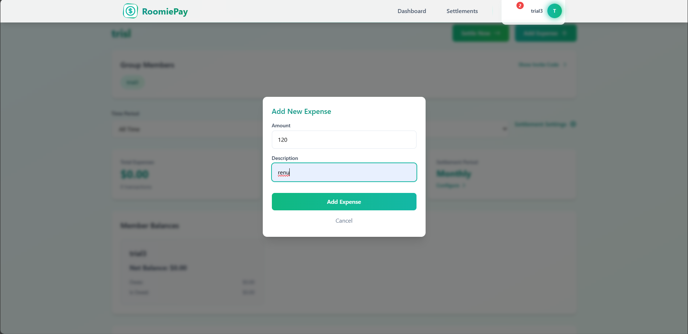
  </td>
</tr>
<tr>
  <td width="50%">
    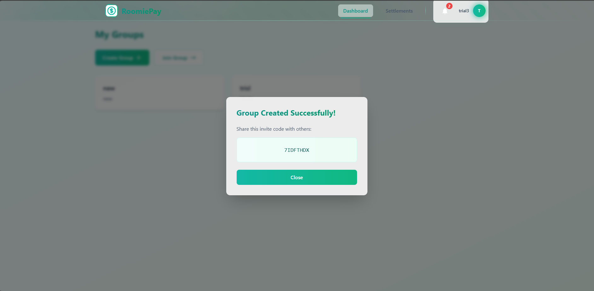
  </td>
  <td width="50%">
    <h3>👫 Group Management</h3>
    <ul>
      <li>Create groups for different living arrangements</li>
      <li>Invite roommates with a unique code</li>
      <li>Track shared expenses within each group</li>
    </ul>
  </td>
</tr>
<tr>
  <td width="50%">
    <h3>⚖️ Smart Settlement System</h3>
    <ul>
      <li>Automatic calculation of who owes what</li>
      <li>Optimize transactions to minimize payment count</li>
      <li>Configurable settlement periods</li>
    </ul>
  </td>
  <td width="50%">
    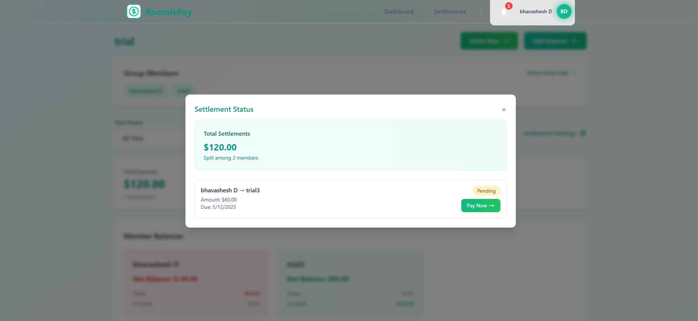
  </td>
</tr>
<tr>
  <td width="50%">
    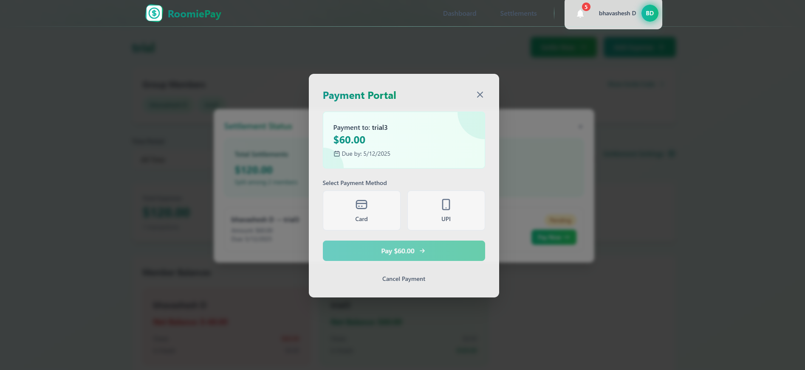
  </td>
  <td width="50%">
    <h3>💸 Seamless Payments</h3>
    <ul>
      <li>Integrated payment processing</li>
      <li>Payment confirmation system</li>
      <li>Complete payment history</li>
    </ul>
  </td>
</tr>
<tr>
  <td width="50%">
    <h3>🔔 Real-time Notifications</h3>
    <ul>
      <li>Get alerts when you need to pay someone</li>
      <li>Receive notifications when you get paid</li>
      <li>Stay updated on group activity</li>
    </ul>
  </td>
  <td width="50%">
    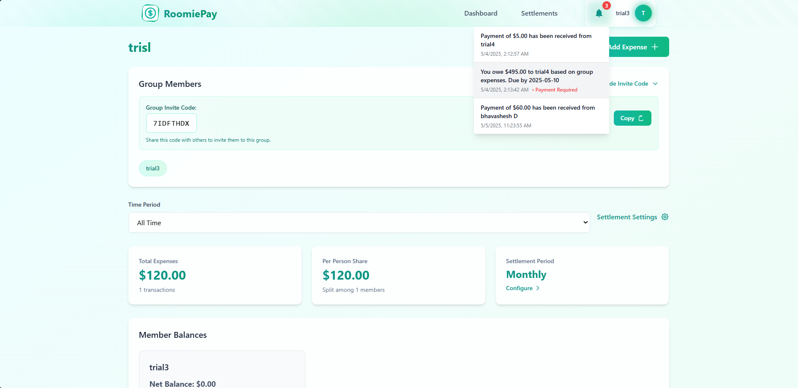
  </td>
</tr>
</table>

---

## 📸 Screenshots

<div align="center">
  <table>
    <tr>
      <td>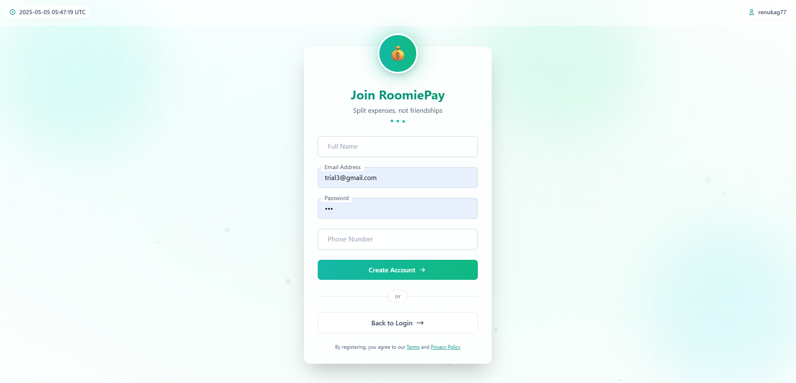<br><em>Login Screen</em></td>
      <td>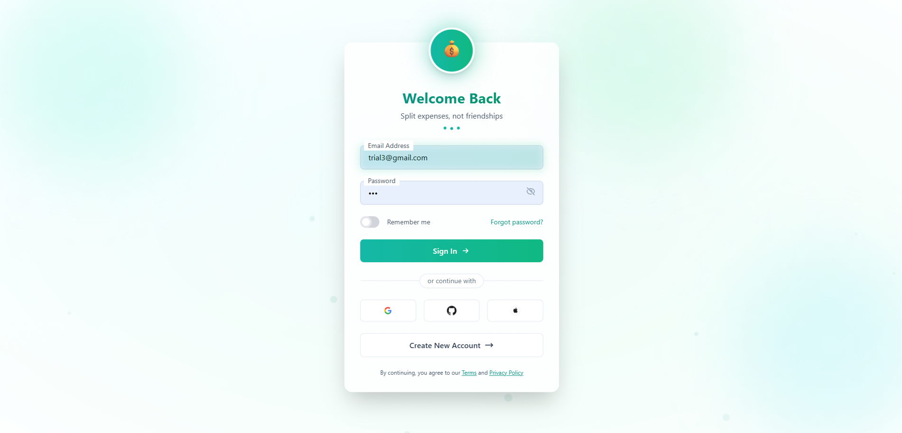<br><em>Registration Screen</em></td>
    </tr>
    <tr>
      <td>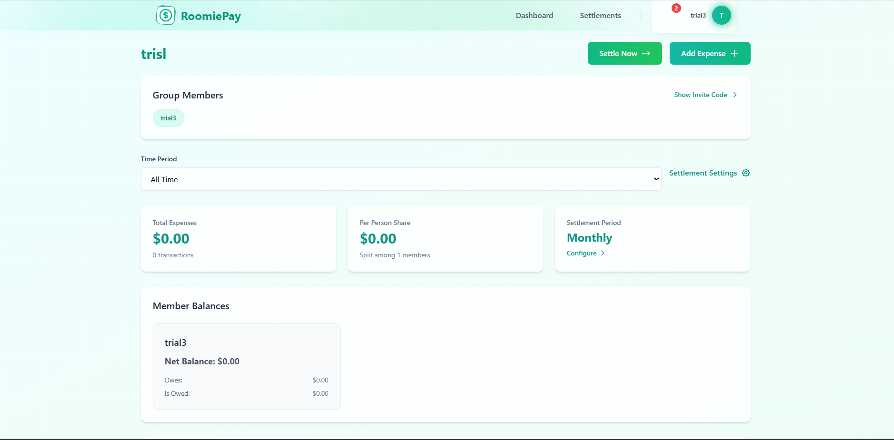<br><em>User 1 Dashboard</em></td>
      <td>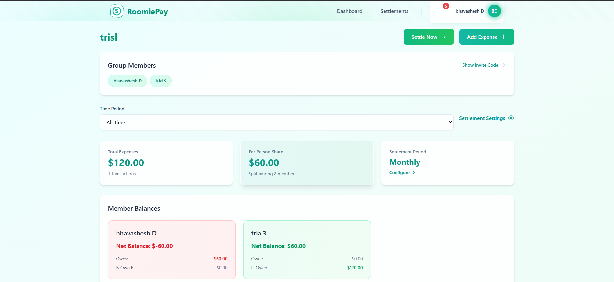<br><em>User 2 Dashboard</em></td>
    </tr>
    <tr>
      <td>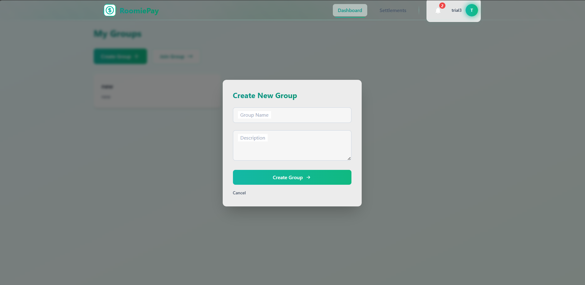<br><em>Creating a New Group</em></td>
      <td>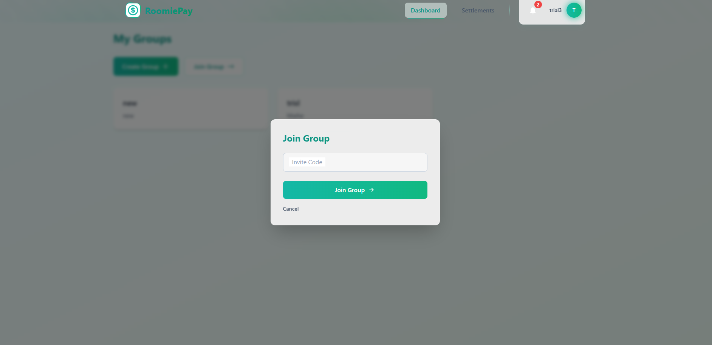<br><em>Joining an Existing Group</em></td>
    </tr>
    <tr>
      <td>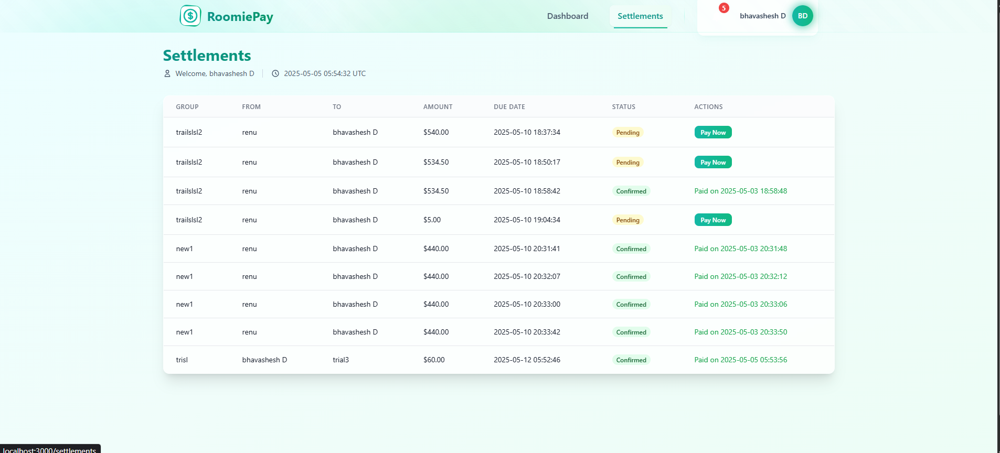<br><em>Settlement Summary</em></td>
      <td>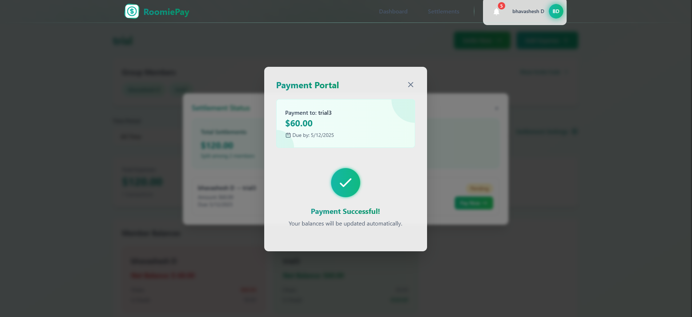<br><em>Successful Payment</em></td>
    </tr>
  </table>
</div>

---

## 🛠️ Technologies Used

<div align="center">
  <table>
    <tr>
      <th>Frontend</th>
      <th>Backend</th>
      <th>Database</th>
    </tr>
    <tr>
      <td>
        <ul>
          <li>React</li>
          <li>Tailwind CSS</li>
          <li>Framer Motion</li>
          <li>Axios</li>
        </ul>
      </td>
      <td>
        <ul>
          <li>FastAPI</li>
          <li>SQLAlchemy ORM</li>
          <li>Pydantic</li>
          <li>JWT Authentication</li>
        </ul>
      </td>
      <td>
        <ul>
          <li>MySQL</li>
          <li>Relational Schema</li>
          <li>Transaction-safe</li>
        </ul>
      </td>
    </tr>
  </table>
</div>

---

## 🚀 Installation

### Backend Setup

```bash
# Navigate to backend directory
cd backend

# Install required packages
pip install -r requirements.txt

# Set up environment variables for database connection
# Edit .env file with your database credentials

# Run the FastAPI server
uvicorn backend:app --reload
```

### Frontend Setup

```bash
# Navigate to frontend directory
cd frontend

# Install dependencies
npm install

# Start development server
npm start
```

---

## 📂 Project Structure

```
RoomiePay/
├── backend/
│   ├── backend.py                # Main FastAPI server implementation
│   ├── database.py               # Database connection configuration
│   ├── models.py                 # SQLAlchemy ORM models
│   ├── schemas.py                # Pydantic validation schemas
│   └── security.py               # Auth and security functions
│
├── frontend/
│   ├── public/                   # Static assets
│   │   └── index.html            # HTML entry point
│   │
│   └── src/                      # React application source
│       ├── App.js                # Main React application component
│       ├── index.js              # JavaScript entry point
│       ├── index.css             # Global styles
│       │
│       ├── components/           # React UI components
│       │   ├── Dashboard.js      # Dashboard view
│       │   ├── Group.js          # Group management 
│       │   ├── Login.js          # Authentication
│       │   ├── Notifications.js  # User notifications
│       │   ├── PaymentPortal.js  # Payment processing
│       │   ├── Settlements.js    # Settlements management
│       │   └── SettlementConfig.js # Settlement settings
│       │
│       └── services/
│           └── api.js            # API client for backend communication
```

---

## 📊 Database Schema

<div align="center">
  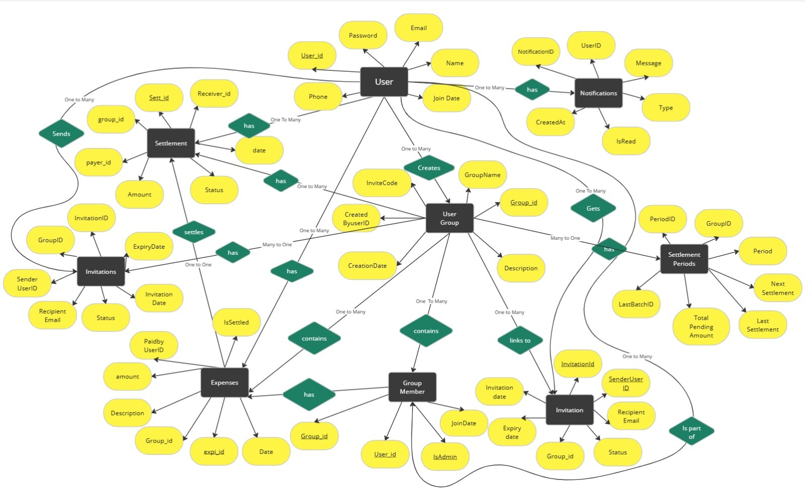
  <p><em>Entity Relationship Diagram</em></p>
</div>

### Key Tables

<table>
  <tr>
    <td width="50%">
      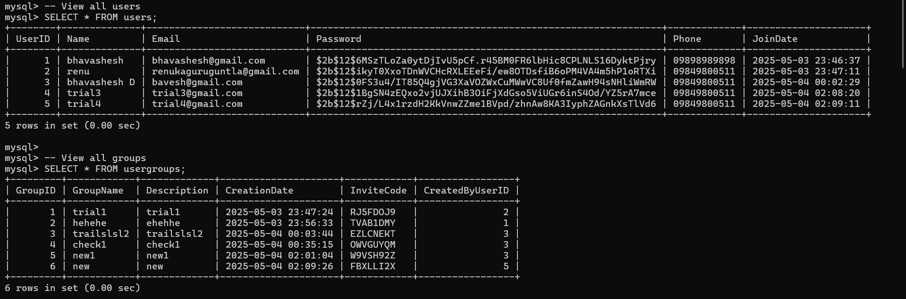
      <p align="center"><em>Users Table</em></p>
    </td>
    <td width="50%">
      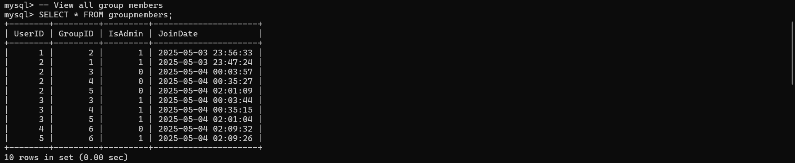
      <p align="center"><em>Group Members Table</em></p>
    </td>
  </tr>
  <tr>
    <td width="50%">
      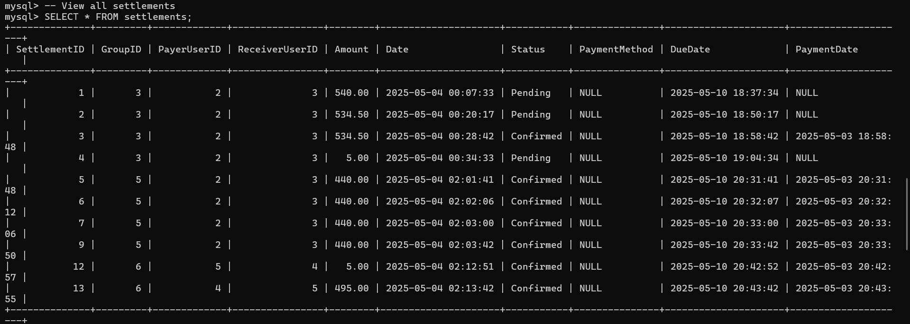
      <p align="center"><em>Settlements Table</em></p>
    </td>
    <td width="50%">
      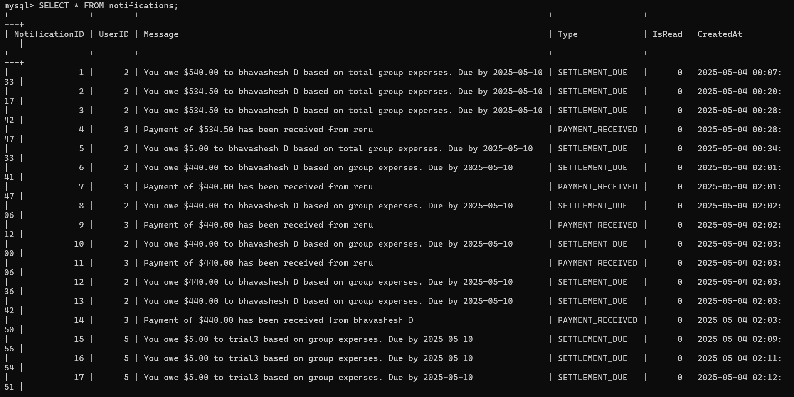
      <p align="center"><em>Notifications Table</em></p>
    </td>
  </tr>
</table>

---

## 📡 API Endpoints

<table>
  <tr>
    <th>Endpoint</th>
    <th>Method</th>
    <th>Description</th>
  </tr>
  <tr>
    <td><code>/register</code></td>
    <td>POST</td>
    <td>Register a new user</td>
  </tr>
  <tr>
    <td><code>/token</code></td>
    <td>POST</td>
    <td>Get authentication token</td>
  </tr>
  <tr>
    <td><code>/groups</code></td>
    <td>POST</td>
    <td>Create a new group</td>
  </tr>
  <tr>
    <td><code>/groups</code></td>
    <td>GET</td>
    <td>Get user's groups</td>
  </tr>
  <tr>
    <td><code>/groups/{group_id}/expenses</code></td>
    <td>GET</td>
    <td>Get group expenses</td>
  </tr>
  <tr>
    <td><code>/expenses</code></td>
    <td>POST</td>
    <td>Create an expense</td>
  </tr>
  <tr>
    <td><code>/groups/{group_id}/balances</code></td>
    <td>GET</td>
    <td>Get group member balances</td>
  </tr>
  <tr>
    <td><code>/groups/{group_id}/finalize-splits</code></td>
    <td>POST</td>
    <td>Calculate and create settlements</td>
  </tr>
  <tr>
    <td><code>/settlements/{settlement_id}/process-payment</code></td>
    <td>POST</td>
    <td>Process settlement payment</td>
  </tr>
  <tr>
    <td><code>/notifications</code></td>
    <td>GET</td>
    <td>Get user notifications</td>
  </tr>
</table>

---

<div align="center">
  <h2>💡 Smart Settlement Algorithm</h2>
  
  <p>RoomiePay uses an optimized debt-simplification algorithm to minimize the number of transactions needed to settle all debts within a group.</p>
  
  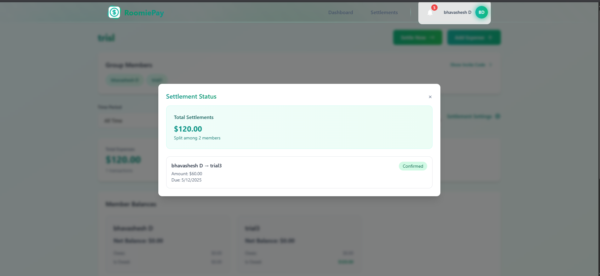
</div>

---

## 🔒 Authentication Flow

1. **Registration**: Users create accounts with email and password
2. **Login**: Users receive JWT token for authentication
3. **Protected Resources**: All API endpoints (except registration and login) require valid JWT token
4. **Token Expiry**: Tokens expire after a set period for security

<div align="center">
  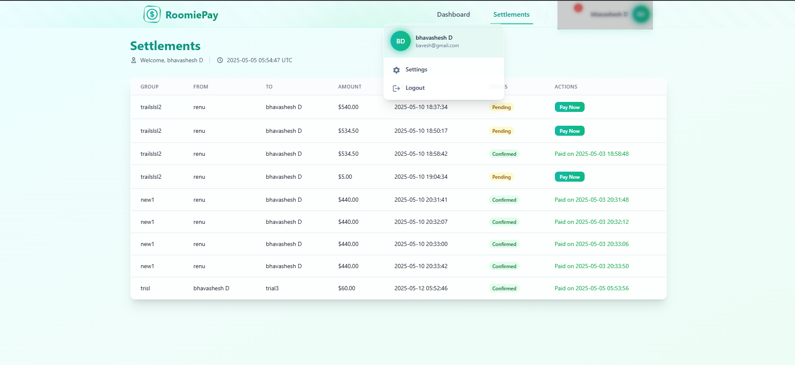
</div>

---

## 🌈 UI/UX Features

- **Responsive Design**: Works on mobile, tablet, and desktop
- **Intuitive Interface**: Easy-to-understand expense tracking  
- **Real-time Feedback**: Instant notification of actions
- **Gradient Animations**: Smooth color transitions for visual appeal
- **Modern Components**: Clean, intuitive form elements and cards

---

<div align="center">
  <h2>📱 Mobile View</h2>
  <p>RoomiePay is fully responsive and works perfectly on mobile devices!</p>
  
  <table>
    <tr>
      <td width="33%">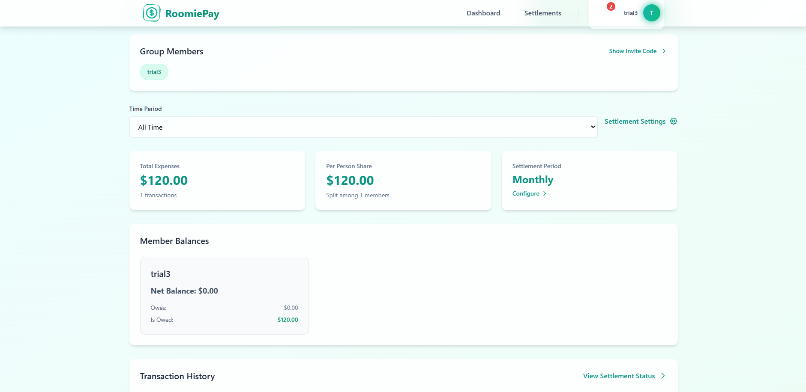</td>
      <td width="33%">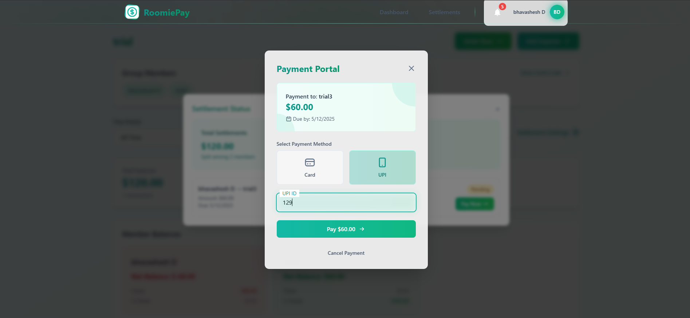</td>
      <td width="33%">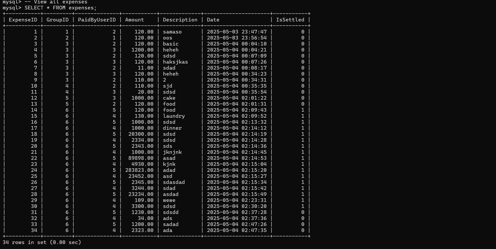</td>
    </tr>
  </table>
</div>

---

## 👨‍💻 Contributors

<div align="center">
  <table>
    <tr>
      <td align="center">
        <a href="https://github.com/madboy482">
          <br/>
          <sub><b>madboy482</b></sub>
        </a>
      </td>
      <td align="center">
        <a href="https://github.com/bunnysunny24">
          <br/>
          <sub><b>bunnysunny24</b></sub>
        </a>
      </td>
      <td align="center">
        <a href="https://github.com/renukag77">
          <br/>
          <sub><b>renukag77</b></sub>
        </a>
      </td>
    </tr>
  </table>
</div>

---

## 📄 License

This project is licensed under the MIT License - see the [LICENSE](LICENSE) file for details.

```
MIT License

Copyright (c) 2025 RoomiePay Team

Permission is hereby granted, free of charge, to any person obtaining a copy
of this software and associated documentation files (the "Software"), to deal
in the Software without restriction, including without limitation the rights
to use, copy, modify, merge, publish, distribute, sublicense, and/or sell
copies of the Software, and to permit persons to whom the Software is
furnished to do so, subject to the following conditions:

The above copyright notice and this permission notice shall be included in all
copies or substantial portions of the Software.

THE SOFTWARE IS PROVIDED "AS IS", WITHOUT WARRANTY OF ANY KIND, EXPRESS OR
IMPLIED, INCLUDING BUT NOT LIMITED TO THE WARRANTIES OF MERCHANTABILITY,
FITNESS FOR A PARTICULAR PURPOSE AND NONINFRINGEMENT. IN NO EVENT SHALL THE
AUTHORS OR COPYRIGHT HOLDERS BE LIABLE FOR ANY CLAIM, DAMAGES OR OTHER
LIABILITY, WHETHER IN AN ACTION OF CONTRACT, TORT OR OTHERWISE, ARISING FROM,
OUT OF OR IN CONNECTION WITH THE SOFTWARE OR THE USE OR OTHER DEALINGS IN THE
SOFTWARE.
```

---

<div align="center">
  <p>
    <strong>RoomiePay</strong> — Making shared living expenses simpler since 2025
  </p>
  <p>
    © 2025 • RoomiePay Team
  </p>
</div>
